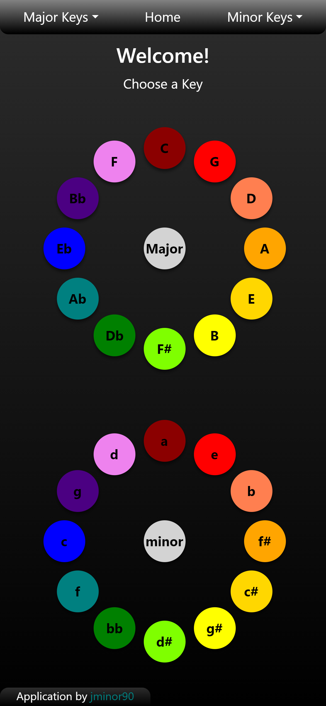

# Circle-Of-Fifths

[](https://opensource.org/licenses/MIT)


## Description
A simple application that describes the musical key signatures listed in the Circle Of Fifths. The app uses JSON Data and an algorithm to build musical scales. Built in ReactJS.

## Table of Contents

- [Usage](#usage)
- [How it works](#how-it-works)
- [Developer Thoughts](#developer-thoughts)
- [Questions](#questions)


## Usage
Link to Application: https://jminor90.github.io/circle-of-fifths/

Simply open the application link, and choose a key signature. The page will write out the scale, give you it's relative Minor/Major and how many accidentals are in that scale.




## How it works
The application uses the Circle of Fifths in Music Theory to build scales based primarily on three things
  - The starting Note of the scale
  - How many accidentals? (Sharps # / Flats b)
  - And are those accidentals Sharp, Flat, or none at all?

It starts with the "back-bone" of the whole application ```data.json``` Here is an example of that data.

```json
{ 
  "major": [
    {
      "key": "D",
      "accidentals": 2,
      "accExpr": 1,
      "relativeMinor": "B"
    }
  ]
}
```
The are two "modes" in the data Major and Minor. In this example we're looking at the D Major Scale.

Of course the note the scale will start on is D, and it is listed as having 2 "accidentals".

accExpr or Accidental Expression is a number 0 - 2 and describes if those accidentals will be Sharp, Flat or none at all.

- 0 - All Natural Scale (typically C Major or A Minor)
- 1 - Sharps(#)
- 2 - Flats(b)

The data also lists the relative Minor key (and vice-versa for Minor keys), in this case being B Minor, which has the same number of accidentals as D Major.

So now that we have all the building blocks how do we put the scale together?

First lets understand how scales are built in the Circle of Fifths.

All scales are in "alphabetical" order, and the musical alphabet only goes A-G and repeats back to A after G.

So in this example of D Major our scale will go
```
D E F G A B C
```
But we're not done yet, now we have to take a look at our accidentals and accidental expression.

D Major has 2 accidentals and they're sharp(#).

Knowing that we have to understand the Order of Sharps (There is also an Order of Flats, but for now we'll focus on Sharps)

The Order of Sharps is always the same it goes
```
["F#", "C#", "G#", "D#", "A#", "E#", "B#"]
```
So if we have 2 sharps in our scale that would F# and C#

So in the key of D Major, every F becomes F# and every C becomes C#

so the D Major Scale will be
```
D E F# G A B C#
```

Now that we know how the Circle of Fifths works in Music Theory how does it work in this application?
That data is pulled through ```scaleBuilder.js```

```javascript
export default function scaleBuilder (keyVar, accNum, accExpr) {
  // Takes in the Key and removes # or b from it so we can build a scale
  let key = keyVar;
  key = key.replace(/[^A-Z\.]+/g, "");

  //All scales are alphabetical; this loop will start building a scale starting with the Key given
  //and loop around to give 7 notes in scale order
  const list = ["A", "B", "C", "D", "E", "F", "G"];
  let i = list.indexOf(key);
  let newList = [];
  for (let counter = 0; counter < 7; ++counter) {
    newList.push(list[i]);
    i = (i + 1) % list.length;
  }

  //AccidentalExpression 1 = Sharp, 2 = Flat, 0 = Natural
  switch (accExpr) {
    
    // Sharps
    case 1:
      // Order of sharps will always remain the same, this takes in how many sharps given for that scale
      let sharpCount = accNum

      const sharpsOrder = ["F#", "C#", "G#", "D#", "A#", "E#", "B#"]
      // which notes are sharp in that scale; ex: 1 = [F#]; 2 = [F#, C#]
      let sharpResult = sharpsOrder.slice(0,sharpCount)

      // replaces any notes in scale with proper notes with sharps; ex F = F#, C = C#
      for (let i=0; i < sharpCount; i++) {
        newList.splice(newList.indexOf(sharpResult[i].replace(/[^A-Z\.]+/g, "")),1,sharpResult[i])
      }

      return(
        newList
      )
  }
}
```
** There of cousre is a switch case for Flat Expressions and the Default Case is for all natural Scales (C Major and A Minor)

And that is how each scale is built. I also took it upon myself to go beyond what is listed normally in the circle of fifths and included other key signatures just in case. (Such as C# Major)


## Developer Thoughts
- I'd like to learn how to generate sound so that the scale can be audible to hear.

- I'd also like to go further than Major and Minor scales and look into the rest of the musical modes (Ionian, Dorian, Phrygian, etc)

- I built this thinking of mobile design first, could use some fine tuning style-wise when displayed on a bigger screen.

- Adding more custom graphics such as a Piano roll would be nice too

## Questions?

- Github: https://github.com/jminor90

- Email: minor.jbm@gmail.com

